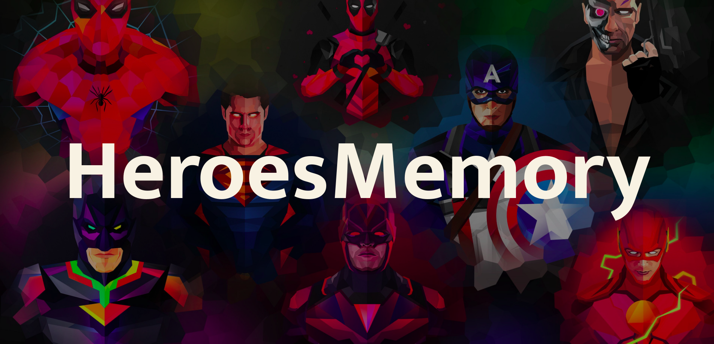
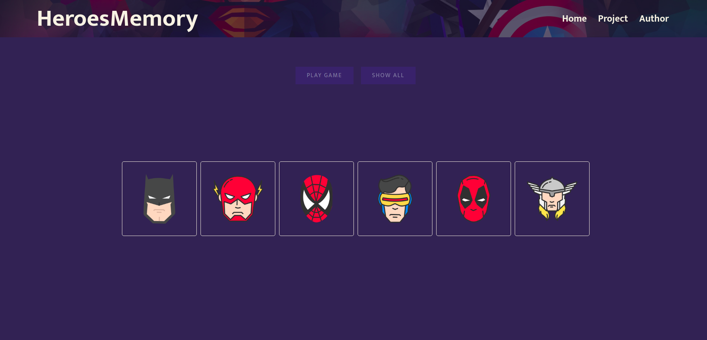
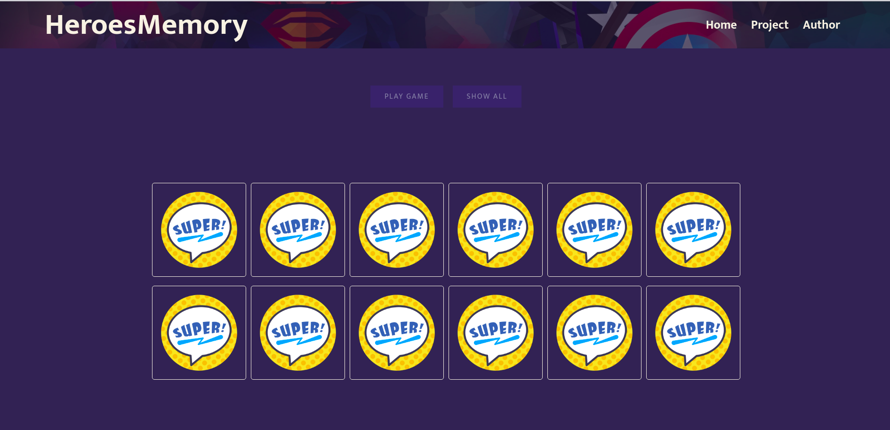
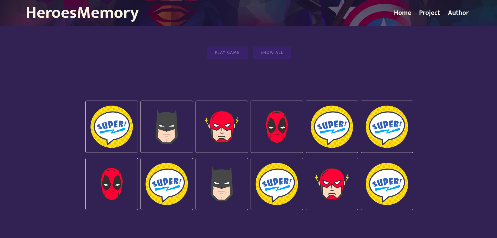

<h2 align="center">
  Javascript Game Memory
</h2>

  

  

  

### :memo: About the project
A Heroes Memory Game, during the teacher's javascript fundamentals course [Erick Wendel](https://github.com/ErickWendel) we created a final project where we put into practice everything we learned in the course, the final project is about if from a memory game with the heroes theme, I took the liberty to style the entire project from scratch to leave with a different interface than what was done
during the course classes. Feel free to improve this project with me, make your improvement and send a pull request. :D

### :rocket: Main technologies
<ul>
  <li>HTML</li>
  <li>CSS</li>
  <li>JAVASCRIPT </li>
</ul>

### 🎨 Screenshots

  
  
  
  

